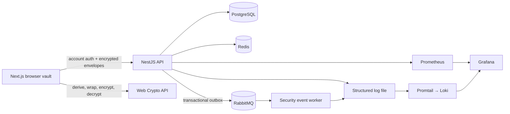

# KeyNest


KeyNest is a working, educational password-manager MVP built as an Nx
TypeScript monorepo. It demonstrates browser-side vault encryption, durable
session and audit storage, asynchronous security-event delivery, and a local
observability stack.

## Project status

**Work in progress — last verified August 22, 2026.** The implemented vertical
slice is suitable for architecture review, local testing, and demonstrations
with synthetic data. It is not a hosted password-manager service, has no stable
public-availability commitment, and must not be used for real credentials.

A temporary HTTPS demo may be shared while the maintainer's local Docker stack
and tunnel are running. Its address can change without notice. The
[operations runbook](docs/operations-runbook.md#temporary-public-demo-cloudflare-quick-tunnel)
documents that demo path and its limitations.

## Languages and platform

The repository contains TypeScript/TSX, JavaScript configuration, CSS, SQL
migrations, YAML infrastructure/CI configuration, a Dockerfile, and Shell and
Batchfile launchers. JSON and Markdown are also used for configuration and
documentation, but they are data and prose rather than application languages.


> KeyNest has not undergone an independent security audit. Use synthetic test
> credentials only—do not store real passwords in it. Report suspected
> vulnerabilities through the [security policy](SECURITY.md), not a public
> issue.

## What works

- Register, sign in, sign out, list sessions, and revoke sessions
- Argon2id account-password hashing and opaque HttpOnly sessions
- Redis-backed login/register rate limits and session-cache acceleration
- CSRF protection on state-changing authenticated routes
- Restrictive response security headers on both the Next.js web app and API
- Create and unlock a browser-encrypted vault
- Add, edit, delete, search, reveal, copy, and generate credentials
- AES-256-GCM authenticated encryption with per-envelope nonces and AAD
- PostgreSQL persistence for users, sessions, encrypted vaults, audit records,
  and an outbox
- RabbitMQ publisher confirms, durable queues, manual worker acknowledgements,
  bounded prefetch, and a dead-letter queue
- Structured redacted Pino logs shipped through Promtail to Loki
- Prometheus request/runtime/outbox metrics and a provisioned Grafana dashboard
- Docker Compose for the complete local system

## Runtime architecture



The account password is sent over the authenticated HTTP channel and hashed
with Argon2id. The separate vault master password never leaves the browser. It
derives a wrapping key with PBKDF2-SHA256; the API receives only the encrypted
vault key and encrypted item envelopes.

## Run the complete system

Requirements: Docker Desktop and a recent Node.js/npm installation.

```bash
docker compose up -d --build
docker compose ps
npm run test:e2e
```

The migration container runs before the API, and the web container starts only
after API readiness succeeds. The first image build can take a few minutes.

| Service             | URL / address                                  | Local credentials |
| ------------------- | ---------------------------------------------- | ----------------- |
| KeyNest             | http://localhost:3000                          | create an account |
| API readiness       | http://localhost:3333/api/health/ready         | none              |
| API metrics         | http://localhost:3333/api/metrics              | none              |
| Grafana dashboard   | http://localhost:3001/d/keynest-overview       | admin / keynest   |
| RabbitMQ management | http://localhost:15672                         | keynest / keynest |
| Prometheus          | http://localhost:9090                          | none              |
| Loki                | http://localhost:3100/ready                    | none              |
| PostgreSQL          | localhost:5433, database/user/password keynest | keynest           |

These credentials and open management ports are intentionally local-only
defaults. Replace them and terminate TLS at a reverse proxy before any remote
deployment.

Stop without deleting durable volumes:

```bash
docker compose down
```

See the [operations runbook](docs/operations-runbook.md) for logs, queues,
health checks, failure behavior, and backups.

## Development and verification

```bash
npm install
npm run infra:up
npm run db:migrate
npm run dev:api
npm run dev:web
```

Useful checks:

```bash
npm run test:api
npm run test:e2e       # expects the complete stack to be running
npm run lint
npm run build
npm run verify
```

`npm run test:e2e` creates synthetic data, performs a real encrypted round
trip, verifies that its plaintext sentinel is absent from server-side storage,
waits for the RabbitMQ outbox to publish, and removes the test account.

## Repository security automation

The public GitHub repository has Dependabot vulnerability alerts and security
updates, secret scanning with push protection, CodeQL default scanning for
JavaScript/TypeScript, and private vulnerability reporting enabled. Weekly
version-update checks cover both npm and GitHub Actions dependencies through
`.github/dependabot.yml`.

These controls help detect dependency, code, and credential-leak risks. They do
not certify the application, prove the absence of vulnerabilities, or replace
the runtime and security-boundary tests described above.

## Security boundaries and trade-offs

- The server stores vault KDF metadata, wrapped-key material, nonces,
  ciphertext, item type, revisions, and timestamps. It does not receive
  decrypted credential fields, the vault master password, or the unwrapped
  vault key.
- A non-extractable `CryptoKey` and decrypted items live in React memory only
  while unlocked. The UI auto-locks after 15 minutes of inactivity.
- Local search works after decryption. There is intentionally no server-side
  plaintext search.
- PBKDF2 was selected because it is available through native Web Crypto. It is
  CPU-hard, not memory-hard; a future Argon2id browser migration must introduce
  a new versioned envelope and migration path.
- JavaScript cannot guarantee complete memory zeroization. XSS remains a
  critical threat while the vault is unlocked.
- There is deliberately no vault-password recovery. Losing it loses access to
  the encrypted vault.
- The outbox/RabbitMQ path provides at-least-once delivery. Consumers must use
  the event ID for idempotency.

Read [ADR 001](docs/adr/001-client-side-encryption.md),
[ADR 002](docs/adr/002-runtime-and-observability.md), the
[threat model](docs/threat-model.md), and the
[implementation status](docs/implementation-status.md) before describing the
project in an interview.

## Intentionally not included yet

This is a coherent personal-vault MVP, not the entire longer-term platform
roadmap. TOTP/2FA, account or vault recovery, family sharing, an Angular admin
application, enterprise RBAC/policy, passkeys, browser extensions, a production
deployment, and an independent security assessment remain future work.

The optional AI privacy boundary is test-covered, but no remote model adapter
is connected. AI is not part of authentication, encryption, or vault access.
