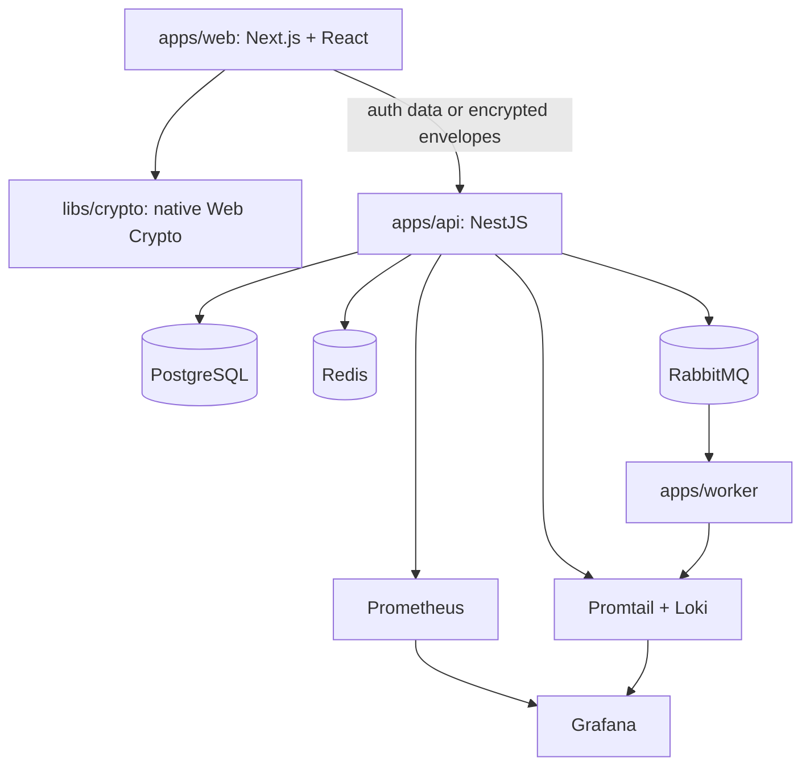

# KeyNest Architecture

Last updated: August 15, 2026

## Product boundary

KeyNest is a personal encrypted-vault MVP. The Next.js application owns the
interactive browser experience and cryptography. NestJS authenticates users,
authorizes ownership, and stores only encrypted vault envelopes. PostgreSQL is
the durable source of truth; Redis and RabbitMQ have operational roles.

## Synchronous request path

1. The session guard hashes the opaque cookie and resolves an active session
   from Redis or PostgreSQL.
2. State-changing routes also validate the per-session CSRF token.
3. Vault/item queries derive ownership from the authenticated user and never
   trust a user ID supplied by the client.
4. PostgreSQL persists envelope fields, revisions, and safe metadata.
5. The API returns a stable error envelope and request ID; logs and metrics are
   emitted on completion.

## Asynchronous event path

Audit creation inserts both the audit row and an outbox row in one PostgreSQL
transaction. A background API service publishes pending outbox events using
RabbitMQ publisher confirms. The worker consumes from a durable queue using
manual acknowledgement. See ADR 002 for failure and duplication semantics.

## Package responsibilities

- `apps/web`: stateful UI and browser-only plaintext handling
- `apps/api`: HTTP boundary, auth/session/authorization, persistence, outbox,
  metrics, and structured logging
- `apps/worker`: security-event consumer; currently validates and logs events
- `libs/crypto`: versioned key wrapping, item encryption, decryption, and secure
  random password generation
- `libs/types`: shared public API/envelope contracts
- `infrastructure`: migrations and the local observability/messaging stack

The longer-term multi-application platform in `implementation-plan.md` remains
a roadmap, not part of this deployed MVP.
