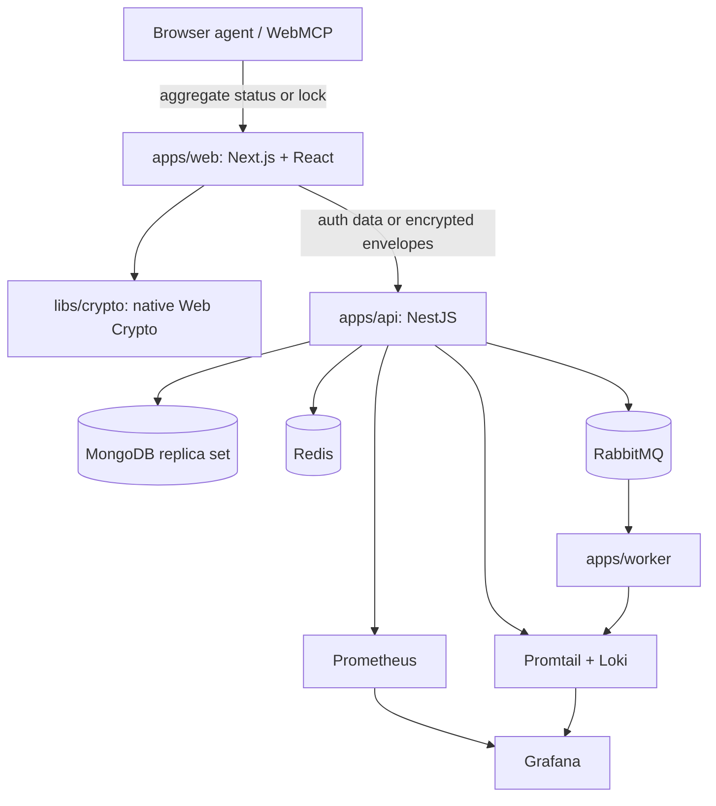

# KeyNest Architecture

Last updated: August 30, 2026

## Product boundary

KeyNest is a personal encrypted-vault MVP. The Next.js application owns the
interactive browser experience and cryptography. NestJS authenticates users,
authorizes ownership, and stores only encrypted vault envelopes. MongoDB is
the durable source of truth; Redis and RabbitMQ have operational roles.

## Synchronous request path

1. The session guard hashes the opaque cookie and resolves an active session
   from Redis or MongoDB.
2. State-changing routes also validate the per-session CSRF token.
3. Vault/item queries derive ownership from the authenticated user and never
   trust a user ID supplied by the client.
4. MongoDB persists envelope fields, revisions, and safe metadata.
5. The API returns a stable error envelope and request ID; logs and metrics are
   emitted on completion.

## Asynchronous event path

Audit creation inserts both the audit document and an outbox document in one
MongoDB transaction. A background API service claims pending outbox events with
a short lease and publishes them using RabbitMQ publisher confirms. The worker
consumes from a durable queue using manual acknowledgement. See ADR 002 and ADR
004 for failure and duplication semantics.

## Package responsibilities

- `apps/web`: stateful UI and browser-only plaintext handling
- `apps/web/app/webmcp.ts`: experimental, reduced-state browser-agent boundary;
  it receives no credential payloads, vault keys, tokens, or API client
- `apps/api`: HTTP boundary, auth/session/authorization, persistence, outbox,
  metrics, and structured logging
- `apps/api/src/app/domains/identity`: account, authentication, session, CSRF,
  Redis session-cache, and identity persistence ownership
- `apps/api/src/app/domains/vault`: vault-key envelope and credential-item
  application flows, entities, MongoDB mappings, indexes, and HTTP routes
- `apps/api/src/app/domains/audit`: audit/outbox entities, atomic persistence,
  outbox publication, and audit HTTP routes
- `apps/api/src/app/platform`: reusable MongoDB connection, RabbitMQ adapter,
  health, HTTP request context, configuration, AI boundary, and observability
- `apps/worker`: security-event consumer; currently validates and logs events
- `libs/crypto`: versioned key wrapping, item encryption, decryption, and secure
  random password generation
- `libs/types`: shared public API/envelope contracts
- `infrastructure`: the local observability/messaging stack

The longer-term multi-application platform in `implementation-plan.md` remains
a roadmap, not part of this deployed MVP.

## API dependency rules

The NestJS API is a modular monolith with three bounded contexts. Every context
contains four explicit layers:

1. `domain`: framework-neutral entities and policies;
2. `application`: use-case services and input contracts;
3. `infrastructure`: MongoDB, Redis, or messaging adapters owned by the domain;
4. `presentation`: controllers, validation DTOs, and request guards.

The context module is its composition root and `public-api.ts` is the only
supported entry point for another domain. Application services accept plain
input contracts rather than `class-validator` HTTP DTOs. Platform code may
coordinate domain infrastructure for startup and operational tooling, but it
does not own the business model. `domain-boundaries.spec.ts` checks the layer
shape, framework independence, presentation isolation, and cross-domain import
rule. See ADR 006.
