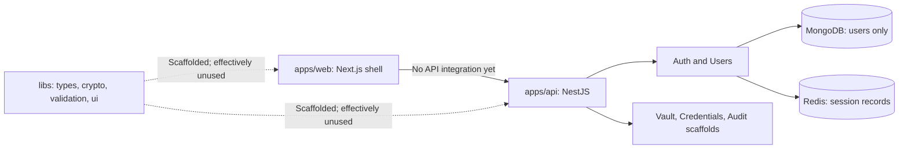

# KeyNest Current Repository Analysis

Status: Phase 1 architecture baseline
Last verified: August 14, 2026

> Historical baseline: this document describes the repository before the
> August 15 MVP implementation. See `docs/implementation-status.md` for the
> current evidence-backed state.

## Purpose

This document records what exists in the repository before the KeyNest platform
evolution begins. It separates implemented behavior from plans in older
documentation so that later decisions are based on code, not aspiration.

No product feature is implemented as part of this analysis.

## Executive Assessment

KeyNest is an early Nx TypeScript monorepo, not yet a working password manager.
It has a useful backend authentication slice, a Redis session-creation slice, a
static Next.js shell, and a strong documented security direction. Most vault,
encryption, audit, UI, testing, database, and operational capabilities are still
scaffolds.

The requested platform can evolve from this foundation without a repository
rewrite. The main justified structural changes are:

1. Migrate the small MongoDB persistence surface to the required PostgreSQL
   model behind repositories.
2. Evolve the current generic `web` shell into the public Next.js website and
   add separate React Vault and Angular Admin applications without duplicating
   product responsibilities.
3. Turn the documented client-side encryption boundary into a versioned,
   tested contract before implementing vault CRUD.
4. Complete authentication, authorization, and session lifecycle behavior
   before exposing protected data operations.
5. Add enforceable Nx boundaries, test targets, CI, and reproducible local
   infrastructure incrementally.

The repository must continue to carry the disclaimer that it is educational
and has not been independently security audited. It must not store real secrets
until that statement can honestly change.

## Evidence Reviewed

The analysis is based on the current working tree, including:

- root package, Nx, TypeScript, ESLint, and project configuration;
- all source files under `apps/api`, `apps/web`, and `libs`;
- API unit tests and the uncommitted AI privacy-boundary tests;
- existing architecture, database, authentication, encryption, privacy, and
  roadmap documents;
- the current Git state and local lint, test, and build results.

The working tree already contained uncommitted AI privacy-boundary work before
this phase. That work is treated as user-owned and was not modified.

## Current Architecture

### Workspace Inventory

| Area             | Current implementation                                                                     | Maturity                             |
| ---------------- | ------------------------------------------------------------------------------------------ | ------------------------------------ |
| Monorepo         | Nx 22 workspace with strict TypeScript, ESLint, Prettier, Next.js and NestJS plugins       | Foundation                           |
| `apps/web`       | Next.js App Router with one static page and root metadata                                  | Shell                                |
| `apps/api`       | NestJS application with global prefix, cookie parsing, and a strict global validation pipe | Partial                              |
| Users            | Mongoose schema, normalized unique email, hidden `passwordHash`, safe response mapper      | Implemented slice                    |
| Authentication   | Register and login, Argon2id hashing/verification, generic invalid-credential response     | Implemented slice                    |
| Sessions         | Random opaque ID, SHA-256 Redis key, seven-day TTL, HttpOnly cookie set on login           | Creation only                        |
| Vault            | Module, controller, service, and DTO placeholders                                          | Scaffold                             |
| Credentials      | Module, controller, service, and DTO placeholders                                          | Scaffold                             |
| Audit logs       | Module, controller, service, and DTO placeholder                                           | Scaffold                             |
| AI privacy       | Pure allow-list boundary and leakage tests; no provider or network integration             | Uncommitted partial slice            |
| Shared libraries | `types`, `crypto`, and `validation` export nothing; `ui` renders an empty `div`            | Scaffold                             |
| Persistence      | MongoDB/Mongoose for users; Redis for sessions                                             | Partial and inconsistent with target |
| Testing          | Vitest service/controller tests for users, auth, sessions, and privacy boundary            | Focused unit coverage                |
| Delivery         | No Docker Compose, environment example, CI workflow, or deployment definition              | Missing                              |

## Current Runtime Flows

### Registration

1. `POST /api/auth/register` accepts a validated name, email, and password.
2. `AuthService` hashes the password with Argon2id.
3. `UsersService` trims the name, normalizes the email, and inserts a MongoDB
   user.
4. The response contains only `id`, `name`, and `email`.

This is a sound account-credential starting point. It is not a master-password
or vault-key flow.

### Login

1. `POST /api/auth/login` validates email and password.
2. The user is found by normalized email with the normally hidden hash selected.
3. Argon2 verifies the supplied account password.
4. A 256-bit random opaque session ID is generated.
5. Redis receives the session record under a SHA-256 hash of that ID with a
   seven-day TTL.
6. The raw ID is returned only as an HttpOnly, `SameSite=Lax` cookie. The
   `Secure` flag is enabled when `NODE_ENV=production`.

The flow creates a session but cannot yet consume, renew, rotate, list, or
revoke it.

### Vault and Encryption

There is no runtime vault flow. The accepted ADR correctly requires browser-side
encryption and forbids the backend from receiving master passwords, vault keys,
plaintext passwords, notes, or usernames. The crypto library and vault DTOs are
empty, so this remains a design promise rather than an enforced product property.

## Current Data Model

Only one durable application schema exists:

### MongoDB `users`

- `_id`: MongoDB object identifier;
- `name`: required, trimmed, maximum 80 characters;
- `email`: required plaintext email;
- `emailNormalized`: required, lowercased, unique and indexed;
- `passwordHash`: required and excluded from normal queries;
- automatic creation and update timestamps.

Redis session records currently contain `userId`, `createdAt`, `expiresAt`, and
`lastUsedAt`. The TTL is seven days. They are operational records, not a durable
relational session history.

There are no implemented vaults, vault items, folders, roles, permissions,
sharing permissions, security policies, or audit-event records.

## Existing Security Properties

### Implemented

- DTO whitelist validation rejects unknown registration and login fields.
- Passwords are hashed with Argon2id and never returned.
- Email lookup is normalized and duplicate emails become conflict responses.
- Login uses the same public error for missing users and invalid passwords.
- Session identifiers use cryptographically secure randomness.
- Redis stores a hash of the bearer session ID rather than the raw value.
- Login cookies are HttpOnly, path scoped, and conditionally secure in
  production.
- The AI payload boundary constructs allow-listed data and rejects secret-like
  fields recursively; no provider, API key, or network call exists.

### Missing or Incomplete

- No authentication guard reads the session cookie.
- No `me`, logout, logout-everywhere, revocation, renewal, rotation, reuse
  detection, or session-management endpoints exist.
- No authorization, organization scoping, role, or permission enforcement
  exists.
- No CSRF strategy, origin policy, CORS allowlist, security headers, content
  security policy, rate limiting, or trusted proxy policy exists.
- Environment values are not schema-validated and development fallbacks can be
  used accidentally.
- Redis startup is fail-fast, but availability behavior and health checks are
  undocumented.
- Registration is vulnerable to resource exhaustion unless rate limiting and
  calibrated Argon2 parameters are added.
- Client-side key derivation, key wrapping, authenticated encryption, lock,
  memory cleanup, rekey, and recovery flows do not exist.
- Audit events are neither defined nor persisted.
- There is no secret-safe structured logging or redaction policy outside the AI
  design document.

## Frontend State

`apps/web` is a two-element static Next.js page. It has no forms, routing beyond
the home route, API client, authentication handling, vault, encryption, state
management, loading/error states, tests, styling system, accessibility work, or
performance scenario.

The package description and README list Tailwind CSS, React Hook Form, Zod,
TanStack Query, and Zustand, but those dependencies and implementations are not
present. This is documentation drift.

The current Next.js shell is suitable to evolve into the public product website
because it already uses the App Router and static rendering. It should not become
the consumer vault merely because React is available inside Next.js.

## Backend Module State

The NestJS module names provide a reasonable first domain outline, but the
current services access Mongoose directly and there is no repository boundary.
Controllers are thin, which is good, but most are empty. The target will need:

- explicit application/use-case services;
- persistence ports and PostgreSQL adapters;
- authenticated principal and tenant context;
- resource-ownership and permission policies;
- versioned encrypted-envelope validation;
- stable API error and pagination contracts;
- transaction boundaries for rotation, sharing, and audit writes.

An `EncryptionModule` on the backend must validate algorithms, envelope versions,
nonces, sizes, and migration metadata. It must never decrypt personal vault
content or own user vault keys.

## Nx and Shared-Code State

Nx is already in place, so the project is not being moved into a monorepo. The
needed work is to make the monorepo meaningful:

- all projects currently have empty tags;
- the module-boundary rule permits every project to depend on every library;
- there are no domain, platform, or framework ownership constraints;
- shared libraries are placeholders;
- no API-contract generation or runtime validation boundary exists;
- a React component library cannot be consumed directly by Angular.

Shared UI must therefore mean design tokens, icons, and framework-neutral styles,
plus separate React and Angular component adapters where needed. Forcing one
component implementation across frameworks would create coupling rather than
remove duplication.

## Documentation State and Drift

Several documents describe intent as if it were current behavior:

- `docs/architecture.md` shows PostgreSQL while the API connects to MongoDB.
- the README lists frontend and security packages that are not installed.
- the README progress section says authentication is not implemented, while
  registration, login, and session creation now exist.
- `docs/combined-progress.md` is closer to the code but still predates the AI
  privacy boundary and the latest dependency state.
- `docs/auth-design.md`, `docs/encryption-design.md`, and
  `docs/threat-model.md` are empty.
- the requested ADR numbering conflicts with the accepted existing ADR 001 for
  client-side encryption.

Accepted ADR identifiers should remain stable. New decision records should use
the next available numbers and link back to the requested topic list instead of
silently renumbering history.

## Validation Baseline

Commands were run against the current working tree on August 14, 2026.

| Command            | Result | Notes                                                                            |
| ------------------ | ------ | -------------------------------------------------------------------------------- |
| `npm run lint`     | Passed | Six Nx projects; one API result came from cache                                  |
| `npm run test:api` | Failed | Four files and 17 tests passed; auth controller suite could not import `express` |
| `npm run build`    | Failed | Shared libraries and Next.js built; API could not resolve `express` or its types |

`auth.controller.ts` imports `Response` from `express`, but `express` and its
types are not declared directly in the root package. This is the immediate
green-baseline blocker. The issue is not caused by the Phase 1 documents.

There are no React, Angular, API integration, database integration, or end-to-end
test suites. The existing tests use mocks and do not prove MongoDB or Redis
integration.

## Strengths to Preserve

1. **Security boundary is stated early.** Client-side encryption and the
   backend's no-plaintext rule are explicit and already accepted.
2. **Authentication behavior is testable.** Hashing, normalization, safe
   response mapping, generic login failure, and session creation have focused
   tests.
3. **Session bearer material is not stored raw.** The SHA-256 lookup key is a
   reusable pattern for future rotating session or refresh-token records.
4. **Controllers are thin.** Existing controller code mostly handles HTTP
   concerns and delegates behavior.
5. **Strict validation is globally enabled.** Whitelisting and rejecting unknown
   DTO properties are good defaults.
6. **Nx and strict TypeScript are already present.** The project can evolve
   incrementally without a workspace rewrite.
7. **AI is outside the trusted core.** The uncommitted privacy boundary keeps AI
   provider-neutral and away from authentication, cryptography, and vault data.
8. **The repository is honest about being educational.** That disclaimer should
   remain until external security validation supports a stronger claim.

## Weaknesses and Risks

### Priority 0: restore a trustworthy baseline

- API tests and build are red because `express` is undeclared.
- There is no deterministic environment validation or infrastructure setup.
- Current documentation overstates implemented dependencies and capabilities.

### Priority 1: security and domain foundations

- Account authentication and vault unlocking are not separated in the model.
- No end-to-end encrypted envelope contract exists.
- No protected route or authorization layer exists.
- The MongoDB user model conflicts with the mandated PostgreSQL target.
- Session lifecycle and CSRF protection are incomplete.
- Vault, audit, policy, sharing, and permissions have no persistence or behavior.

### Priority 2: product architecture

- There is no consumer vault application.
- There is no enterprise admin application.
- The Next.js website is only a placeholder.
- Shared project boundaries and contracts are unenforced.

### Priority 3: evidence and operations

- No realistic 10,000-item performance baseline exists.
- No integration or end-to-end harness exists.
- No Docker, CI, health checks, observability, or deployment evidence exists.
- Security and threat-model documents are incomplete.

## Migration Constraints

The evolution must follow these constraints:

1. Preserve working behavior with characterization tests before replacing
   adapters.
2. Never send a master password, vault key, decrypted item, session credential,
   or raw user secret to the API, logs, analytics, or AI.
3. Treat the account password and vault master password as separate concepts
   unless a later ADR adopts and correctly implements a reviewed PAKE/verifier
   protocol.
4. Keep PostgreSQL as the authoritative durable store required by the new
   product vision. Redis may be an operational cache/rate-limit/revocation aid,
   not the only source of durable session history.
5. Keep framework responsibilities distinct. Angular Admin cannot inspect
   decrypted consumer vaults; Next.js cannot become a second vault UI.
6. Share contracts, domain vocabulary, tokens, and generated clients—not
   framework-specific state stores or indiscriminate component code.
7. Ship vertical slices behind passing tests rather than generating all modules
   and pages at once.
8. Record measured evidence before making performance or production-readiness
   claims.

## Recommended Migration Path

The detailed plan is in `docs/implementation-plan.md`. At a high level:

1. Freeze this baseline, fix the direct dependency issue, and add environment
   validation.
2. Define versioned API, encrypted-envelope, identity, pagination, and error
   contracts in shared libraries.
3. Introduce PostgreSQL and repository ports, migrate the user behavior, and
   remove Mongoose only after parity tests pass.
4. Complete authentication, session rotation/revocation, CSRF defenses, guards,
   authorization, and audit foundations.
5. Implement vault bootstrap and one encrypted vault-item vertical slice.
6. Build the React Vault around client-side cryptography and explicit server vs
   client state boundaries.
7. Evolve the existing Next.js shell into the public website.
8. Add Angular Admin only after stable admin contracts exist.
9. Enforce Nx ownership boundaries, then complete cross-application testing,
   performance evidence, Docker, CI, and portfolio documentation.

## Phase 1 Exit Decision

The repository is suitable for incremental evolution. A rewrite is neither
necessary nor justified. The next implementation slice should be small: restore
green API validation, choose and record the PostgreSQL data-access strategy, and
introduce a repository-backed user migration with behavior parity. Vault feature
work should wait until the encrypted-envelope and authentication boundaries are
approved.
