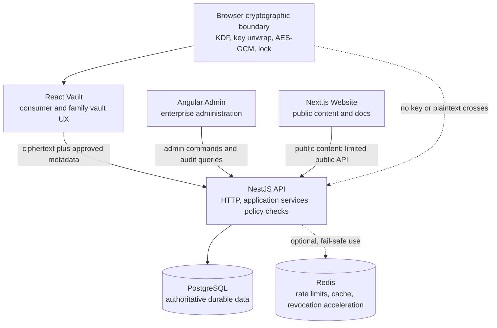

# KeyNest Platform Implementation Plan

Status: Proposed for review
Last updated: August 14, 2026
Depends on: `docs/current-analysis.md`

> This remains the longer-term platform roadmap. The personal-vault MVP and its
> operational stack are now implemented; see `docs/implementation-status.md`.
> Angular Admin, family sharing, enterprise policy, and the other explicitly
> deferred phases below are not delivered.
>
> **Persistence update:** ADR 004 selects MongoDB for the current MVP. The
> PostgreSQL sections below are a later architecture exercise for the expanded
> multi-tenant platform, not the active runtime or an approved migration.

## Goal

Evolve the existing repository into **KeyNest — Secure Password Management
Platform**, a portfolio-quality TypeScript platform that demonstrates deliberate
frontend selection, backend modularity, relational modelling, client-side
encryption, authorization, testing, performance engineering, and explainable
trade-offs.

This is an incremental plan. Passing phase gates matters more than producing a
large feature count.

## Non-Negotiable Boundaries

1. The backend never receives the vault master password, unwrapped vault key, or
   decrypted personal vault fields.
2. Remote AI never receives authentication material, session material, vault
   identifiers, encryption material, or raw/decrypted vault content.
3. The React Vault owns personal vault interaction and client-side cryptography.
4. Angular Admin owns enterprise identity, policy, permission, and audit
   workflows; it cannot decrypt user vaults.
5. Next.js owns public, indexable content; it does not duplicate authenticated
   vault or admin features.
6. MongoDB is the current MVP source of truth. PostgreSQL remains the proposed
   comparison target for the expanded multi-tenant platform. Redis is optional
   operational infrastructure, not a durable vault store.
7. Existing accepted ADRs and working security behavior are preserved until an
   explicit, tested replacement is approved.
8. KeyNest remains labelled educational and unaudited. Test data must be
   synthetic and must not contain real secrets.

## Target Architecture



### Application Responsibilities

| Application     | Owns                                                                                                                        | Must not own                                            |
| --------------- | --------------------------------------------------------------------------------------------------------------------------- | ------------------------------------------------------- |
| React Vault     | registration/login UI, vault unlock/lock, encrypted-item CRUD, local search/filter, family sharing UX                       | enterprise policy administration, public SEO pages      |
| Angular Admin   | organization users, roles, permissions, policies, security events, audit exploration                                        | decrypted personal vault data, marketing content        |
| Next.js Website | home, security, docs, pricing, blog, FAQ, metadata, sitemap, robots                                                         | authenticated vault state, admin workflows              |
| NestJS API      | authentication, sessions, authorization, encrypted-envelope persistence, sharing metadata, policy enforcement, audit events | personal-vault decryption or master-password processing |

## Target Workspace Shape

The requested names are the destination, reached with Nx moves/generators after
baseline tests protect behavior.

```text
apps/
  api/
  react-vault/
  angular-admin/
  next-website/          # evolved from apps/web
  e2e/
    react-vault-e2e/
    angular-admin-e2e/
    next-website-e2e/
libs/
  contracts/             # transport schemas and inferred TypeScript types
  domain/                # framework-neutral value objects and policies
  api-client/            # generated or typed client, no application state
  auth/                  # shared auth contracts and framework adapters
  security/              # headers/policies/redaction; never vault keys
  encryption/            # browser-safe primitives and envelope contracts
  design-tokens/         # framework-neutral colour, spacing, typography tokens
  react-ui/              # React/Next primitives where sharing is justified
  angular-ui/            # Angular components using the same tokens
  testing/               # synthetic factories, contract fixtures, test helpers
```

The existing `types`, `validation`, `crypto`, and `ui` libraries should be moved
or split only when real consumers exist. Empty-library churn provides no value.

## Dependency Rules

Nx tags will encode scope and type, for example:

- scopes: `scope:vault`, `scope:admin`, `scope:public`, `scope:api`,
  `scope:shared`;
- types: `type:app`, `type:feature`, `type:data-access`, `type:ui`,
  `type:domain`, `type:util`;
- platforms: `platform:browser`, `platform:node`, `platform:react`,
  `platform:angular`, `platform:any`.

Required constraints:

- browser libraries cannot import Node-only code;
- the API cannot import framework UI or browser key-management code;
- Angular cannot import React components;
- public website features cannot import vault feature state;
- feature libraries may depend on domain/data-access/UI, not on another app;
- shared contracts remain transport-focused and contain no persistence models.

## Core Security Model

### Separate Authentication From Vault Unlock

For the first production-style version, use two explicitly named secrets:

- **account password**: sent over TLS to the API at registration/login, hashed
  with calibrated Argon2id, and used only for account authentication;
- **vault master password**: used only in the browser to derive a key-encryption
  key and never sent to the API.

This makes the "backend does not know the master password or vault contents"
claim honest. Reusing one master secret for authentication without sending it to
the backend would require a carefully reviewed verifier/PAKE design such as
OPAQUE or SRP. Implementing a home-grown variant is rejected.

### Vault Key Hierarchy

```text
vault master password
        + per-vault random salt and versioned Argon2id parameters
        |
        v
key-encryption key (browser memory only)
        |
        | unwraps
        v
random 256-bit vault data-encryption key (browser memory only)
        |
        | AES-256-GCM with a unique 96-bit nonce per encryption
        v
versioned encrypted item envelopes stored by the API
```

The API stores KDF parameters, salts, wrapped vault keys, nonces, ciphertext,
algorithm/envelope versions, and deliberately approved query metadata. It never
stores an unwrapped key.

Use authenticated additional data to bind at least the envelope version, item
identifier, vault identifier, item type, and revision. A master-password change
re-derives the key-encryption key and re-wraps the vault key instead of
re-encrypting every item.

Key material must stay in memory, never localStorage, sessionStorage, logs,
TanStack Query persistence, analytics, crash reports, or AI prompts. Lock and
logout clear decrypted caches and query data. JavaScript cannot guarantee memory
zeroization, and documentation must state that limit honestly.

### Metadata Policy

Default to encrypting title, username, URL, notes, card data, API keys, and
custom fields. Keep only metadata required for server operation in plaintext:

- owner/tenant and vault identifiers;
- item type if required for routing/limits;
- folder identifier if server-side organization is intentionally accepted;
- favourite flag only if server-side sync/query needs it;
- schema/encryption version, revision, timestamps, and deletion state.

Every plaintext field needs a leakage entry in the threat model. Search and
filter should run locally after sync/unlock rather than leaking searchable vault
fields to PostgreSQL.

### Authentication and Sessions

Recommended design:

- short-lived access token held only in application memory;
- rotating, cryptographically random refresh token in an HttpOnly, Secure,
  narrowly scoped cookie;
- only a token hash, family identifier, generation, expiry, rotation timestamp,
  and revocation state stored in PostgreSQL;
- transactional single-use rotation with family revocation on confirmed reuse;
- a documented small grace strategy for legitimate concurrent refreshes;
- logout revokes the current session; logout everywhere revokes all active
  sessions for the user;
- admin disablement revokes organization or account sessions as policy requires.

Alternative: opaque server sessions for all authenticated requests. This is
simpler and the current Redis code points in that direction, but it does not
demonstrate the requested refresh-token rotation. The useful current behaviors—
random opaque values and hashed storage—will be reused.

CSRF protection will combine strict origin checks, a narrow CORS allowlist,
appropriate SameSite cookies, and a CSRF token for cookie-authenticated mutating
endpoints. XSS remains the higher-impact vault threat and requires a strict CSP,
no raw HTML, dependency review, output encoding, and minimal third-party scripts.

### Sharing

Do not implement sharing by copying a vault key or sending it through the server
in plaintext. A later sharing slice should use per-user public keys and wrap an
item or vault key to each recipient. Revocation stops future access but cannot
make a recipient forget plaintext already seen. Family and organization semantics
must be documented separately.

## Target Backend Design

### Module Responsibilities

| Module                | Responsibility                                                                       |
| --------------------- | ------------------------------------------------------------------------------------ |
| `AuthModule`          | registration, login, access issuance, refresh rotation, password change/reset policy |
| `SessionModule`       | durable session/token-family lifecycle, revocation, listing, cleanup                 |
| `UserModule`          | profiles, account status, memberships; no password verification logic                |
| `VaultModule`         | vault bootstrap, wrapped-key metadata, encrypted item orchestration                  |
| `EncryptionModule`    | validate supported envelope/KDF versions and safe sizes; never decrypt vault items   |
| `SharingModule`       | recipient lookup, grants, wrapped sharing keys, revocation rules                     |
| `AuditModule`         | allow-listed, append-only security and administration events                         |
| `PolicyModule`        | organization policies and evaluators that do not require vault plaintext             |
| `AuthorizationModule` | principal, tenant context, guards, permission and ownership policies                 |

Controllers map HTTP requests and responses. Application services coordinate use
cases and transactions. Domain policies express authorization and invariants.
Repository ports define persistence needs; PostgreSQL adapters implement them.
Database rows and ORM types do not cross controller boundaries.

### Error and API Contracts

Create runtime-validated, versioned contracts for:

- public user and authenticated principal;
- registration, login, refresh, logout, and session listing;
- encrypted vault bootstrap and encrypted item envelopes;
- cursor pagination and stable sort order;
- roles, permissions, grants, and policies;
- audit-event views;
- a stable error envelope with code, message, request ID, and field errors.

OpenAPI should be generated from the API and checked for drift. A typed client can
then be generated or wrapped for each frontend. Shared TypeScript interfaces
alone do not validate network input.

## PostgreSQL Model

The exact ORM/query builder is an ADR decision. The recommended default is
Prisma behind explicit repository adapters because it offers typed queries,
reviewable migrations, transactions, and broad portfolio familiarity. TypeORM
has tighter NestJS decorator integration but more runtime mapping behavior;
Drizzle offers SQL proximity and strong typing but requires more deliberate
repository and migration conventions.

Whichever is chosen, schema and SQL migration files remain the source of truth.

### Required Tables

| Table                  | Key purpose and constraints                                                                                |
| ---------------------- | ---------------------------------------------------------------------------------------------------------- |
| `users`                | UUID PK, unique normalized email, account hash, status, timestamps                                         |
| `vaults`               | owner, KDF/envelope versions, salt, wrapped vault key, revision                                            |
| `vault_items`          | vault FK, item UUID, ciphertext, nonce, AAD version, item type, revision, timestamps, optional soft-delete |
| `folders`              | vault FK, minimal queryable metadata; encrypted display name if practical                                  |
| `sessions`             | user FK, unique token hash, family/generation, expiry, revocation, reuse metadata                          |
| `organizations`        | enterprise tenant and status                                                                               |
| `organization_members` | scoped user membership and lifecycle                                                                       |
| `roles`                | platform or organization-scoped role with unique scoped name                                               |
| `permissions`          | stable permission code                                                                                     |
| `user_roles`           | membership/user-to-role relation with uniqueness constraints                                               |
| `role_permissions`     | role-to-permission relation with uniqueness constraints                                                    |
| `sharing_permissions`  | resource, grantor/grantee, permission, wrapped key envelope, revocation                                    |
| `security_policies`    | organization-scoped versioned policy configuration                                                         |
| `audit_events`         | actor, tenant, action, target, safe metadata, outcome, timestamp                                           |

Database constraints—not only service checks—must enforce unique normalized
emails, valid enum/check values, foreign keys, nonnegative versions, and one
active grant/assignment where required.

### Index and Pagination Direction

- `users(lower(email_normalized))` unique, or a canonical stored value plus a
  unique index;
- active sessions by `(user_id, revoked_at, expires_at)` and unique token hash;
- vault item sync by `(vault_id, updated_at, id)` and revision;
- audit queries by `(organization_id, occurred_at desc, id desc)`, with actor and
  action indexes added only for measured query patterns;
- memberships and grants indexed on both owning and grantee directions.

Use cursor pagination with deterministic `(timestamp, id)` ordering for vault
sync and audit streams. Avoid offset pagination on large, mutable tables. Explain
query plans with `EXPLAIN (ANALYZE, BUFFERS)` against synthetic data before
claiming index improvements.

## Frontend Architecture

### React Vault

Use an Nx React application rather than Next.js so its purpose is visibly a
client-heavy authenticated product.

Recommended layers:

```text
app shell and providers
  -> route features
    -> feature components and hooks
      -> domain operations
        -> API client, crypto adapter, encrypted local cache
```

State ownership:

| State                   | Tool                                      | Examples                                                                        |
| ----------------------- | ----------------------------------------- | ------------------------------------------------------------------------------- |
| Server state            | TanStack Query                            | ciphertext pages, folders, audit views, sharing grants, permissions             |
| Client/session UI state | Zustand                                   | locked/unlocked state, selected filters, layout preferences, auto-lock deadline |
| Form state              | React Hook Form plus runtime schema       | login, registration, item editor                                                |
| Sensitive working state | dedicated in-memory vault service/context | derived/unwrapped keys and decrypted records                                    |

Keys and decrypted records must not be persisted by Zustand devtools or Query
cache. Query data stays ciphertext. On lock, clear sensitive services, derived
views, timers, and relevant query caches.

For 10,000 synthetic items, use incremental ciphertext sync, worker-assisted
decrypt/index work if measurements justify it, a local search index, list
virtualization, route-level code splitting, stable selectors, and memoization at
measured hotspots. Do not add memoization everywhere without profiler evidence.

### Angular Admin

Use standalone Angular APIs, strict template/type checking, reactive forms,
dependency injection, functional guards/interceptors where appropriate, and
smart route containers around presentational components.

NgRx owns genuinely shared, eventful admin state such as users, roles,
permissions, policy editing, and audit filters/results. Component-local state
stays local. Effects demonstrate cancellation and resilience:

- `debounceTime` for user/audit search;
- `switchMap` to cancel stale queries;
- explicit loading, empty, partial, and error states;
- typed error mapping and retry only for safe operations.

Angular is justified here by standardized patterns, DI, RxJS workflows, forms,
and predictable large-team conventions—not by a claim that React cannot build
admin interfaces.

### Next.js Website

Evolve `apps/web` into `apps/next-website` using an Nx move after preserving its
build. Use Server Components for content-heavy pages, static generation for
docs/blog entries, route metadata for canonical/Open Graph data, and generated
`sitemap.ts` and `robots.ts`.

Keep interactive client components narrow. Content should build without the API
where possible. Security documentation must accurately distinguish implemented,
planned, and audited properties.

Next.js is justified by server rendering, static generation, metadata, routing,
and content delivery. A React SPA would add client runtime while providing worse
indexability and content-loading behavior for this use case.

## Delivery Phases and Gates

### Phase 1 — Analysis and Plan

Deliverables:

- `docs/current-analysis.md`;
- this implementation plan;
- confirmed baseline command results;
- explicit preservation and migration constraints.

Gate: architecture and sequencing are reviewed before product implementation.

### Phase 2 — Backend and Security Foundation

#### 2.0 Restore green baseline

- add the direct Express runtime/types dependency or remove the adapter-specific
  type import cleanly;
- add validated configuration with no production fallback URLs;
- run uncached lint, unit tests, type checks, and builds;
- document local MongoDB/Redis requirements until their replacement is ready.

Gate: all existing projects build and all current tests pass.

#### 2.1 Contracts and PostgreSQL decision

- write ADRs for PostgreSQL data access, authentication/session design, API
  contract validation, and encrypted-envelope format;
- create the PostgreSQL migration foundation and test database harness;
- add repository ports and characterize current user behavior;
- migrate users from Mongoose to PostgreSQL without changing public behavior;
- remove Mongoose only when parity, integration, and migration tests pass.

Gate: registration and login pass against PostgreSQL; MongoDB is absent from the
runtime dependency graph; rollback and local reset procedures are documented.

#### 2.2 Authentication and authorization

- implement access/refresh issuance, single-use rotation, reuse handling,
  current-session logout, logout everywhere, expiry, and revocation;
- add current-user and session-management endpoints;
- add cookie/origin/CSRF/CORS/header/rate-limit policy;
- add authentication guards, tenant context, permission policies, and ownership
  checks;
- persist allow-listed audit events for security actions.

Gate: unit, PostgreSQL/Redis integration, and API-level tests cover happy paths,
expiry, revocation, replay, concurrency, CSRF, and cross-user/tenant denial.

#### 2.3 Encrypted vault vertical slice

- implement vault bootstrap metadata and wrapped-key storage;
- implement browser encryption primitives with known-answer and tamper tests;
- define a size-bounded, versioned encrypted item envelope;
- implement create, list/sync, update with optimistic concurrency, and delete for
  one generic item shape;
- emit redacted audit metadata without ciphertext or secrets.

Gate: an end-to-end test proves plaintext sentinel values never appear in API
requests, PostgreSQL fields, logs, audit metadata, analytics hooks, or AI payloads.

### Phase 3 — React Vault Product Slice

- generate `react-vault` with route-level boundaries and test setup;
- implement registration, login, refresh bootstrap, protected routes, logout,
  unlock/lock, and auto-lock;
- implement password, secure-note, API-key, and credit-card schemas inside the
  encrypted payload;
- implement CRUD, favourites, folders/categories, local search/filter, loading,
  error, empty, offline-expiry, and conflict states;
- add accessibility and responsive behavior;
- create the 10,000-item synthetic benchmark and record the baseline before
  optimizing.

Gate: component/workflow tests pass; the primary E2E user journey passes; lock
clears sensitive state; performance measurements are reproducible.

### Phase 4 — Next.js Public Website

- move and rename the existing `web` shell with Nx tooling;
- build home, security, documentation, pricing, blog, and FAQ routes;
- use Server Components/static generation appropriately;
- implement canonical metadata, Open Graph, sitemap, robots, structured data,
  accessibility, and link checking;
- publish security claims from verified architecture status.

Gate: static build passes, metadata is tested, pages work without authenticated
API availability, and Lighthouse/accessibility budgets are recorded.

### Phase 5 — Angular Enterprise Admin

- add the Angular application only after admin API contracts stabilize;
- implement organization user listing/disablement and session revocation;
- implement roles, permissions, policy forms, guards, interceptors, and audit
  dashboard;
- use NgRx and RxJS for the shared workflows described above;
- prove tenant isolation and denied actions at the API, not only in routes/UI.

Gate: service, component, effect, policy, and E2E admin tests pass, including
cross-tenant denial and disabled-user behavior.

### Phase 6 — Nx Boundary and Sharing Consolidation

Nx exists from day one, so basic tagging and boundaries begin earlier. This
phase completes extraction and cleanup after real duplication appears:

- finalize contract, API-client, auth, security, encryption, design-token, and
  framework-specific UI libraries;
- remove accidental cross-application dependencies;
- add dependency-graph checks and affected-project CI;
- implement sharing only after the encryption and authorization designs pass a
  focused threat-model review.

Gate: enforced tags reject forbidden imports; no framework-specific library is
mislabelled as universal; shared code has at least two legitimate consumers.

### Phase 7 — System Verification, Documentation, Docker, and CI

- create Dockerfiles and Compose services for PostgreSQL, Redis if retained,
  API, and all three frontends;
- add `.env.example` with fake placeholders and documented ownership;
- add health/readiness checks, migration execution, non-root containers, and
  graceful shutdown;
- run lint, format check, type checks, unit, integration, E2E, build, dependency
  boundary, migration, and secret-scanning jobs in CI;
- complete architecture, database, security, threat, performance, operations,
  and interview documentation;
- rehearse failure cases and record evidence.

Gate: a clean checkout starts reproducibly, CI is green, synthetic E2E journeys
pass, recovery/rollback is documented, and README claims match evidence.

## Testing Strategy

| Layer               | Required evidence                                                                                                     |
| ------------------- | --------------------------------------------------------------------------------------------------------------------- |
| Domain/unit         | KDF/envelope validation, permission policies, state reducers/selectors, mapping and error behavior                    |
| Crypto              | known-answer vectors where applicable, random nonce behavior, wrong-key/tamper/AAD failure, version migration         |
| API integration     | real PostgreSQL migrations/constraints/transactions, Redis behavior if retained, HTTP cookies/headers/guards          |
| Contract            | OpenAPI/schema compatibility and generated-client fixtures                                                            |
| React               | components plus registration/login/unlock/CRUD/lock workflows with Testing Library                                    |
| Angular             | services, components, guards, interceptors, NgRx reducers/selectors/effects, RxJS cancellation                        |
| Next.js             | route rendering, metadata, sitemap/robots, broken links, content build                                                |
| E2E                 | registration, login, vault bootstrap, create/edit/delete, lock/logout, session revocation, admin denial/success paths |
| Security regression | CSRF, IDOR/cross-tenant access, token replay, validation limits, log redaction, plaintext sentinel leakage            |
| Performance         | 10,000-item render/search/unlock scenarios, API pagination, PostgreSQL query plans, bundle budgets                    |

Tests must assert security properties, not only status codes. For example, a
vault-create test inspects the request, database row, audit event, and captured
logs for a unique plaintext sentinel.

## Performance Measurement Plan

### Frontend baseline

Use a deterministic generator for 10,000 encrypted synthetic items. Record:

- initial JavaScript and route-chunk sizes;
- time to usable shell;
- encrypted sync time and bytes transferred;
- vault unlock/decrypt/index time;
- first list render and scroll frame stability;
- search input-to-result latency;
- React commit counts for selection/filter actions;
- memory before unlock, after index, and after lock.

Profile first, then compare virtualization, worker use, indexing, code splitting,
stable selectors, and targeted memoization one change at a time. Store hardware,
browser, data-set seed, command, and raw results with every report.

### Backend and database baseline

Measure cursor-page latency and throughput for vault sync, session listing, user
search, and audit queries at representative synthetic cardinalities. Capture
query plans before and after indexes. Define latency and bundle budgets only after
the first repeatable baseline; do not invent impressive numbers.

## Application Security Checklist

Before an externally reachable demo:

- validated configuration and HTTPS termination assumptions;
- strict allowlisted CORS and origin policy;
- CSRF defense for cookie endpoints;
- Secure, HttpOnly, SameSite, path-scoped cookies;
- CSP, HSTS in HTTPS environments, frame restrictions, MIME protections, and a
  deliberate referrer policy;
- route and use-case authorization, ownership, and tenant isolation;
- request/body/envelope size limits and rate limits;
- secret-safe logging, audit allowlists, and error redaction;
- dependency and container scanning with triaged findings;
- backup/restore and key-metadata migration rehearsal;
- session replay, refresh race, and logout-everywhere tests;
- no third-party script in the unlocked vault without an explicit threat review;
- the AI leakage suite remains green and the AI feature remains optional.

## ADR Backlog

The existing accepted `ADR 001: Use Client-Side Encryption for Vault Data` keeps
its identifier. Renumbering an accepted record would damage traceability. Add:

| ADR | Decision topic                                           |
| --- | -------------------------------------------------------- |
| 002 | React for the consumer Vault                             |
| 003 | Angular for Enterprise Admin                             |
| 004 | Next.js for the public website                           |
| 005 | Server state, UI state, and sensitive in-memory state    |
| 006 | Nx ownership and dependency boundaries                   |
| 007 | Authentication, refresh rotation, and session revocation |
| 008 | PostgreSQL and data-access adapter                       |
| 009 | Encrypted-envelope and metadata policy                   |
| 010 | Sharing key distribution and revocation limits           |

Every ADR uses Status, Context, Decision, Alternatives, Trade-offs, Consequences,
and Revisit Conditions. ADRs describe decisions actually made, not technologies
merely listed in a prompt.

## Alternatives and Key Trade-offs

| Decision        | Recommended                                             | Main alternative                       | Trade-off                                                                                                  |
| --------------- | ------------------------------------------------------- | -------------------------------------- | ---------------------------------------------------------------------------------------------------------- |
| Persistence     | PostgreSQL behind repositories                          | retain MongoDB                         | More migration work now; better fit for roles, grants, policies, constraints, and required portfolio scope |
| Vault search    | decrypt/index locally                                   | plaintext server search metadata       | Better confidentiality; larger sync/local-compute cost                                                     |
| Auth/session    | memory access token plus rotating opaque refresh cookie | opaque server session on every request | Meets rotation requirement; adds race/replay/CSRF complexity                                               |
| Vault secret    | separate master password                                | same secret with custom verifier       | Honest/simple boundary; an extra user concept                                                              |
| Admin framework | Angular                                                 | second React app                       | More framework/build overhead; stronger evidence of enterprise Angular patterns                            |
| Public site     | Next.js static/server content                           | React SPA                              | More rendering modes to manage; better SEO/content architecture                                            |
| UI reuse        | tokens plus framework adapters                          | universal component library            | Some intentional duplication; avoids unnatural cross-framework coupling                                    |
| Sync pagination | cursor sync plus local index                            | offset/server search                   | More client storage/index work; stable scalable sync without plaintext fields                              |

## Major Risks and Mitigations

| Risk                                      | Impact                            | Mitigation                                                                                    |
| ----------------------------------------- | --------------------------------- | --------------------------------------------------------------------------------------------- |
| Scope expands into three unfinished demos | Portfolio remains shallow         | finish and verify backend plus React vertical slice before Next/Angular breadth               |
| Security language exceeds implementation  | Misleading portfolio claims       | map every README claim to tests/design status; retain unaudited disclaimer                    |
| XSS exposes unlocked data                 | Catastrophic vault compromise     | strict CSP, minimal scripts, safe rendering, in-memory keys, auto-lock, threat tests          |
| Refresh rotation races revoke valid users | Reliability and support failure   | transactional rotation, idempotency/concurrency design, tested narrow grace policy            |
| PostgreSQL migration breaks working auth  | Regression                        | repository characterization tests, parallel adapter tests, controlled cutover                 |
| Encrypted metadata blocks useful queries  | UX/performance regression         | client sync/index design, explicit leakage decisions, measure at 10,000 items                 |
| Sharing design leaks keys                 | Cross-user secret exposure        | public-key wrapping, focused threat model, postpone until individual vault is mature          |
| Framework sharing creates coupling        | Slow builds and fragile ownership | share contracts/tokens; keep framework state/UI separate                                      |
| AI feature crosses security boundary      | Secret disclosure                 | preserve allow-list constructors, leakage tests, opt-in, no vault enrichment                  |
| Redis outage blocks all auth              | Availability loss                 | define fail-closed security behavior, health checks, Postgres durability, measured cache role |

## Deliberately Deferred

- browser extension and mobile applications;
- payment processing and real pricing enforcement;
- Kubernetes, microservices, service mesh, sharding, or multi-region writes;
- arbitrary AI tool access to vault or authentication operations;
- account recovery that bypasses the encryption model;
- production claims or real-secret usage;
- sharing before the single-user encrypted vertical slice is tested end to end.

## Documentation Deliverables

By Phase 7 the repository should contain and cross-link:

- current analysis and implementation plan;
- architecture and deployment diagrams;
- database design, migrations, indexes, and query-plan evidence;
- encryption and metadata specification;
- authentication/session design;
- threat model with assets, trust boundaries, threats, mitigations, and residual
  risks;
- performance report with raw reproducible measurements;
- ADR set;
- testing and operations/runbook documentation;
- interview guide grounded only in implemented, measured, or clearly labelled
  alternative designs;
- README with product, architecture, technology decisions, security limitations,
  test evidence, performance evidence, and future scaling options.

## Next Concrete Implementation Slice

After this plan is reviewed:

1. restore the green API baseline by resolving the direct Express dependency;
2. add uncached verification commands and validated environment configuration;
3. write ADR 008 comparing Prisma, TypeORM, and Drizzle for this repository;
4. add PostgreSQL plus a real integration-test harness;
5. introduce `UserRepository` and migrate registration/login with behavior parity;
6. stop and review the migration evidence before session or vault expansion.

That slice is intentionally small. It creates a reliable base for the security
work instead of hiding structural risk behind more screens and modules.
