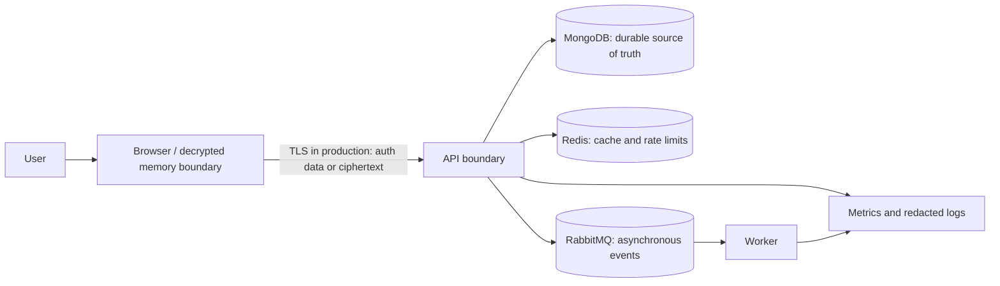

# KeyNest Threat Model

Last reviewed: August 29, 2026

## Scope and security objective

This model covers the personal-vault MVP running in a browser, NestJS API,
MongoDB, Redis, RabbitMQ, worker, and observability stack. Its primary goal is
to prevent the API and a database-only attacker from learning plaintext vault
credentials. It does not claim protection after an attacker controls the
unlocked browser, operating system, or shipped frontend code.

## Assets

- Vault master password and derived wrapping key
- Unwrapped vault key and decrypted credential fields
- Account-password hashes and authenticated sessions
- Encrypted vault/item envelopes and their integrity metadata
- Audit history and security-event delivery state
- Availability of authentication, vault access, and recovery-free unlock

## Trust boundaries

The browser cryptographic boundary is trusted while the tab and delivered
JavaScript are uncompromised. MongoDB, Redis, RabbitMQ, logs, metrics, and a
future AI integration are outside the plaintext-vault boundary.

## Threats and controls

| Threat                                      | Current controls                                                                                                                                      | Important residual risk                                                                                                             |
| ------------------------------------------- | ----------------------------------------------------------------------------------------------------------------------------------------------------- | ----------------------------------------------------------------------------------------------------------------------------------- |
| Database disclosure                         | AES-256-GCM item envelopes; separately wrapped random vault key; account/session tokens stored as hashes                                              | An attacker can perform offline guesses against the wrapped vault key; user password strength and KDF cost matter                   |
| Ciphertext substitution or rollback         | GCM authentication and AAD bind vault ID, item ID, type, envelope version, and revision; optimistic revisions reject stale writes                     | A full database attacker may restore a mutually consistent older snapshot; no trusted external rollback counter exists              |
| XSS or compromised frontend supply chain    | No raw HTML rendering, a restrictive Next.js document CSP, a deny-by-default API CSP, no remote scripts, non-extractable Web Crypto keys, idle lock   | `unsafe-inline` is currently needed for Next.js bootstrap; malicious shipped code or an extension can read plaintext while unlocked |
| Broken object-level authorization           | Every item query resolves the authenticated owner's vault and scopes by that vault ID; item IDs alone do not authorize access                         | MongoDB has no foreign keys; cleanup/orphan repair and negative access tests remain application responsibilities                    |
| Session theft                               | 256-bit opaque cookie, HttpOnly, Secure in production, SameSite=Lax, server-side token hash, expiry and revocation                                    | Malware, a compromised browser, or incorrect proxy/TLS configuration can still expose or replay a live session                      |
| CSRF                                        | Per-session random token, server-side token hash, constant-time comparison, CORS allow-list, SameSite cookie                                          | Any future state-changing route must keep both auth and CSRF guards                                                                 |
| Credential stuffing / Argon2 resource abuse | Generic login errors and Redis per-IP login/register limits                                                                                           | Current limits fail open during Redis errors and do not replace an edge/WAF distributed limit                                       |
| Sensitive logs or events                    | Allow-listed audit metadata, forbidden sensitive keys, Pino redaction, no credential payload in Rabbit events                                         | Free-form error text and future fields require review; redaction is not proof that arbitrary secret values cannot leak              |
| Lost or duplicated async events             | MongoDB audit/outbox transaction, lease claim, publisher confirms, persistent messages, manual ack, stable event ID, DLQ                              | Delivery is at least once; side-effecting consumers must implement durable idempotency                                              |
| Dependency or image compromise              | Lockfile, pinned infrastructure images, production dependency audit in CI                                                                             | Dev-tool advisories and upstream compromise remain; image signing/SBOM/scanning are not yet enforced                                |
| Clipboard or screen disclosure              | Passwords masked by default and shown only on request                                                                                                 | Clipboard managers, screenshots, shoulder surfing, and accessibility tooling are outside the app boundary                           |
| Browser-agent tool disclosure or misuse     | WebMCP module receives reduced state only; no-input schemas; aggregate-only status; lock-only mutation; same-origin policy; abort-scoped registration | The browser agent learns sign-in/lock state and unlocked item count; agent identity and user-consent behavior depend on the browser |
| Lost master password                        | Clear setup warning and no server-side key escrow                                                                                                     | Vault data is unrecoverable by design                                                                                               |

## Explicit non-goals for this MVP

- Protecting plaintext after the local device or unlocked browser is compromised
- Hiding access timing, ciphertext length, item count, item type, or timestamps
- Multi-user sharing, recovery escrow, 2FA, passkeys, or enterprise policy
- Defending a remote deployment that lacks TLS, secret management, network
  isolation, monitoring, and secure backups
- Claiming professional security certification or audit coverage

## Verification obligations

Before changing the envelope format, authentication guards, session cookie,
audit schema, or queue semantics:

1. Add round-trip and tamper tests for the new format.
2. Prove cross-user item access is rejected.
3. Inspect database, audit, outbox, logs, and Rabbit payloads for synthetic
   plaintext sentinels.
4. Exercise dependency failure and retry behavior.
5. Update the ADR, this model, and the operations runbook.
